# ⚡ CatBoost — Employee Attrition Prediction (Triangulated ML Pipeline)

This project implements a **CatBoost-based gradient boosting pipeline** to predict **employee attrition** using triangulated feature pruning (SHAP · Permutation · VIF).  
It includes end-to-end model tuning, validation, and interpretability with calibrated thresholds and performance tracking.

---

## 🚀 Key Highlights
- **CatBoost Classifier** optimized for AUC and F1-score  
- **Triangulated feature selection** (SHAP + Permutation + VIF)  
- Grid search over `learning_rate`, `depth`, `l2_leaf_reg`, and `iterations`  
- **Class-weight tuning** to handle imbalance (final `[1,4]`)  
- 5-fold validation with detailed confusion matrices  
- Threshold tuning for **Balanced** and **High Recall** operating points  
- Explainability with **SHAP** plots and triangulation heatmaps  
- GPU acceleration enabled (`task_type='GPU'`)

---

## 📊 Model Evaluation Results

### Confusion Matrices
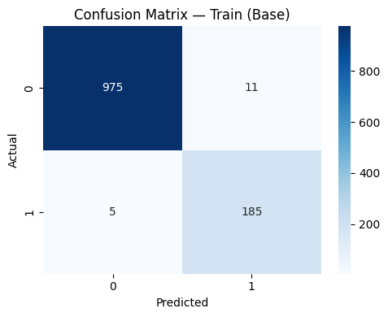
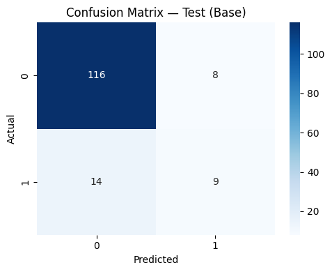

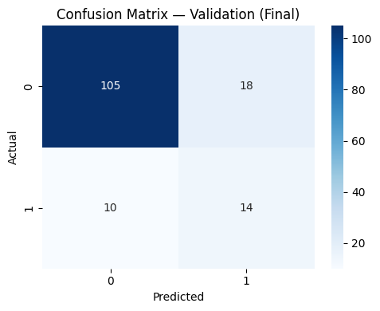

---

### ROC & PR Curves
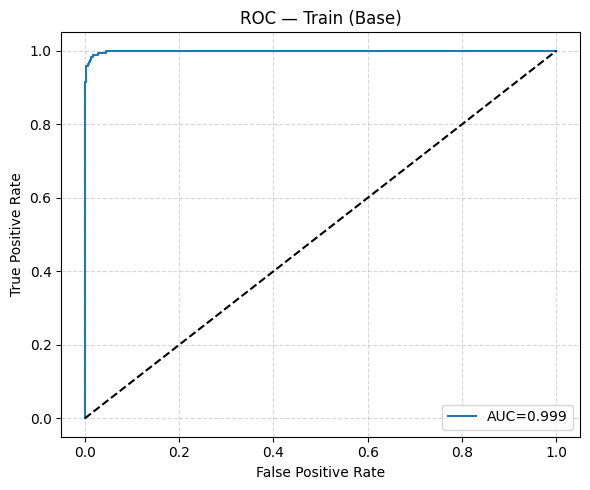
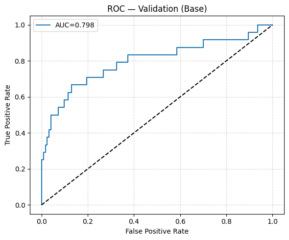
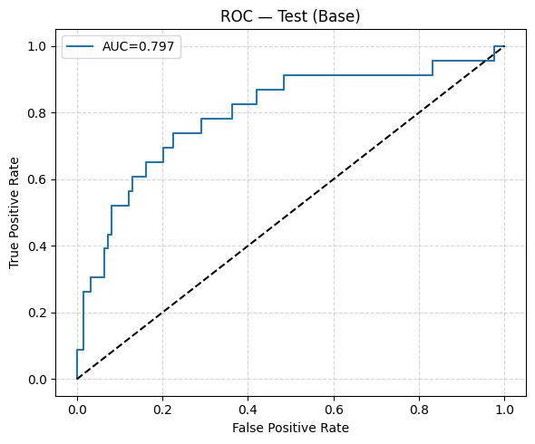
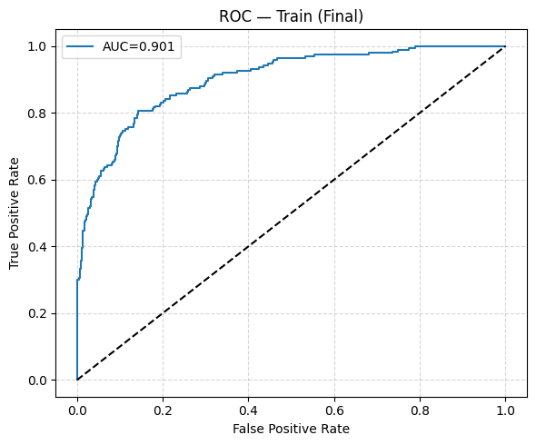
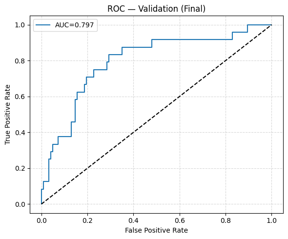
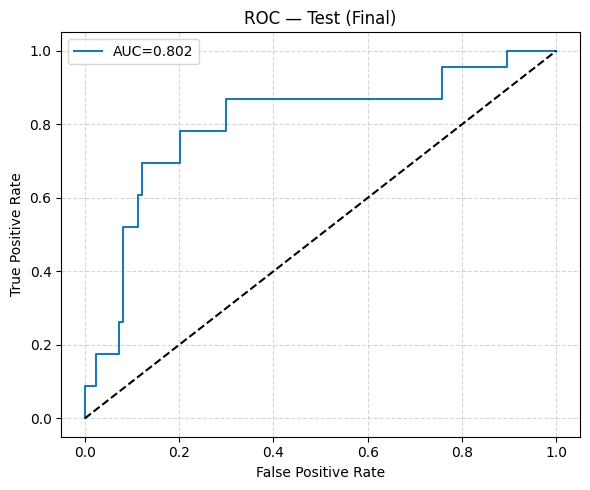
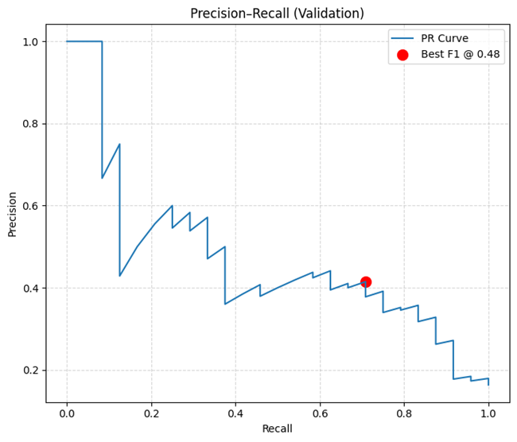

---

### Triangulation & Feature Selection
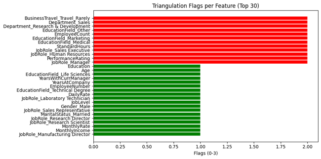

---

## 💡 Insights
- **Best parameters:** `learning_rate=0.03`, `depth=6`, `l2_leaf_reg=3`, `iterations=500`  
- **Validation AUC:** 0.8364 (Base) → 0.7974 (Final)  
- **Test AUC:** 0.8019 after triangulated retrain  
- Threshold tuned to **0.484**, boosting recall to **0.70** and F1 to **0.58**  
- 12 redundant features removed through triangulation (≥2 flags)  

---

## 🧩 Future Enhancements
- Integrate **Optuna** for multi-objective hyperparameter tuning  
- Combine **CatBoost + Logistic Regression** for hybrid interpretability  
- Add **calibration curves** for probability reliability  
- Extend to **multiclass attrition-risk segmentation**

---

## ⚙️ Dependencies
Refer to `requirements.txt` for all dependencies.

---

## 👨‍💻 Author
**Shubham Singh**

---

## 📜 License
MIT License
