# ⚡ Neural Network — Employee Attrition Prediction (Triangulated Deep Learning Pipeline)

This project implements a **Neural Network (Keras–TensorFlow)** pipeline for predicting **employee attrition** using triangulated feature selection and threshold tuning.  
It combines explainability (SHAP + Permutation + VIF), MLflow tracking, and Gradio deployment for interactive inference.

---

## 🚀 Key Highlights
- Deep Feedforward Neural Network (2 hidden layers, ReLU + Dropout)  
- Grid search on **hidden units**, **learning rate**, and **class weights**  
- **Triangulated feature pruning**: SHAP + Permutation AUC Drop + VIF  
- **Threshold tuning** for F1 optimization  
- **Cross-validation parity** with Logistic and CatBoost pipelines  
- **MLflow integration** for parameter, metric, and artifact logging  
- **Gradio UI** with dual tabs — Prediction & Explainability  
- GPU acceleration (TensorFlow backend)

---

## 📊 Model Evaluation Results

### Confusion Matrices
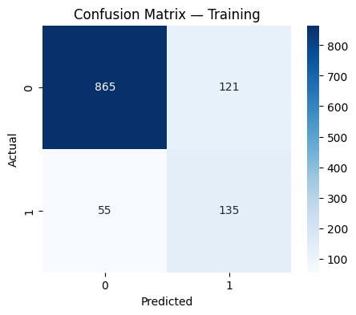
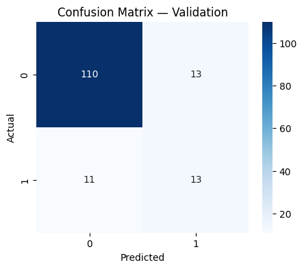
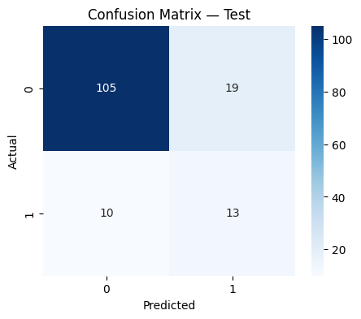

---

### ROC & PR Curves
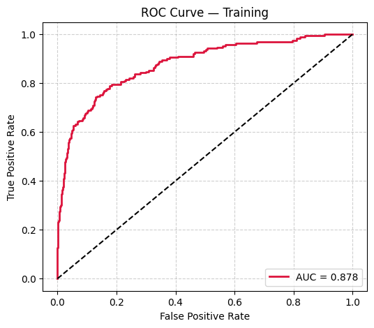
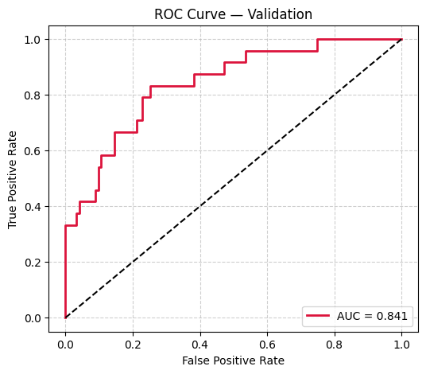
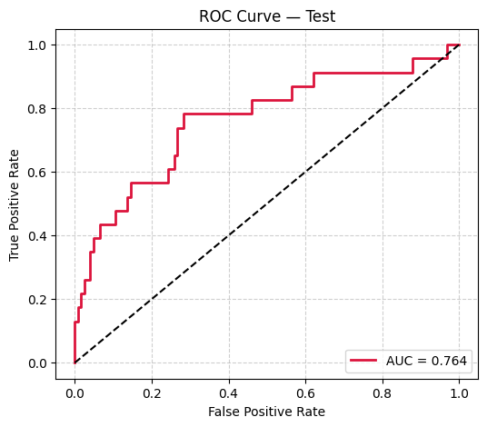
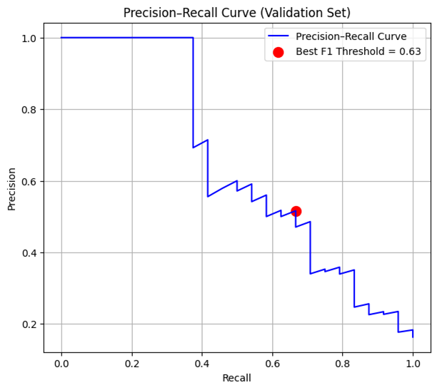

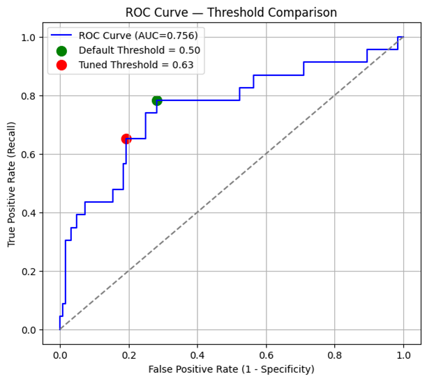

---

### Feature Importance & Triangulation
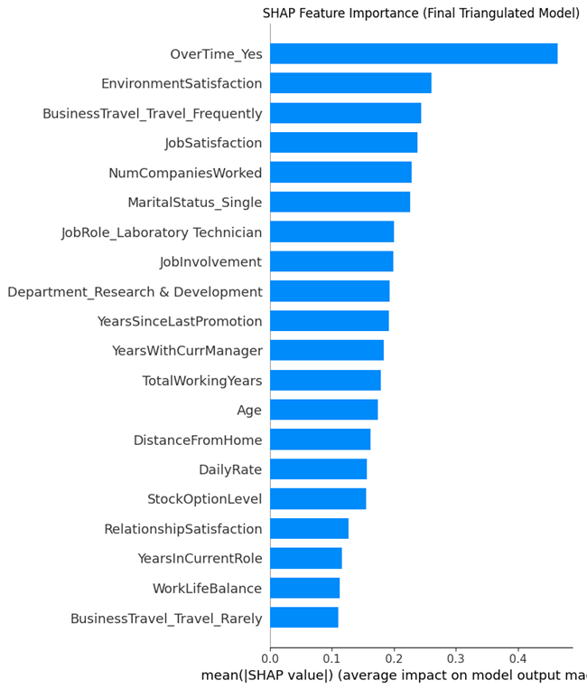
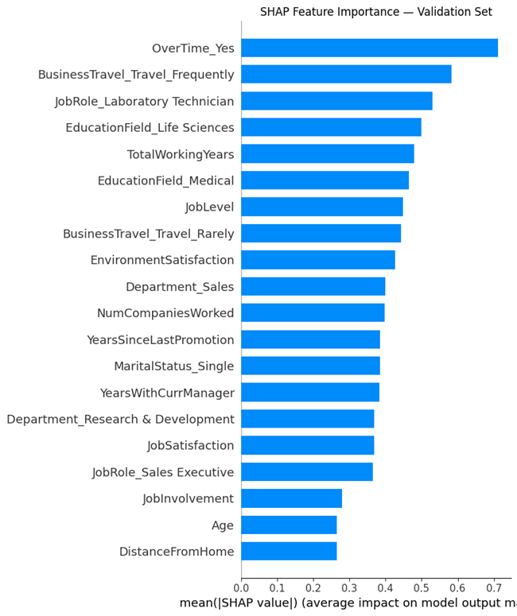
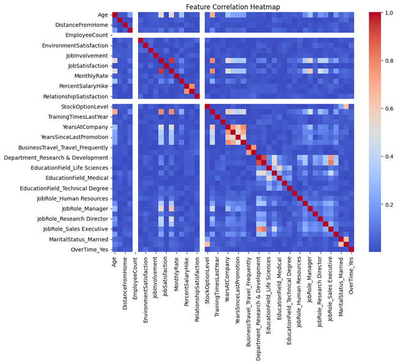
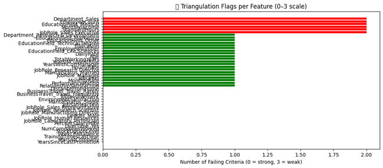
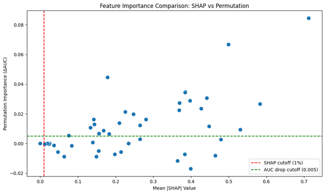

---

## 💡 Insights
- **Best Config:** `hidden_units=128`, `lr=0.001`, `dropout=0.2`, `batch=64`, `epochs=30`, `class_weights=[1,2]`  
- **Triangulated Drop:** 8 features removed (≥2 flags)  
- **Validation AUC:** 0.815 → **0.793 (Final)**  
- **Test AUC:** 0.7703 | **Best-F1 threshold:** 0.553  
- **Validation F1:** 0.5778 → **0.591 (Tuned)**  
- Stable generalization across folds and no drift after retraining  

---

## 🧩 Future Enhancements
- Integrate **Optuna** for automatic hyperparameter search  
- Extend to **multiclass attrition segmentation**  
- Add **drift detection** with MLflow monitoring  
- Deploy model via **Streamlit Cloud** or **Hugging Face Spaces**

---

## ⚙️ Dependencies
Refer to `requirements.txt` for all dependencies.

---

## 👨‍💻 Author
**Shubham Singh**

---

## 📜 License
MIT License
