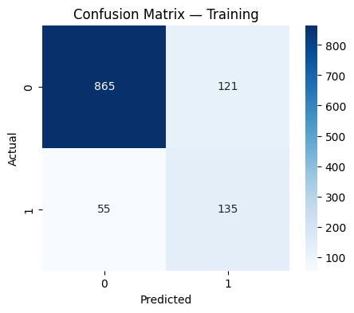
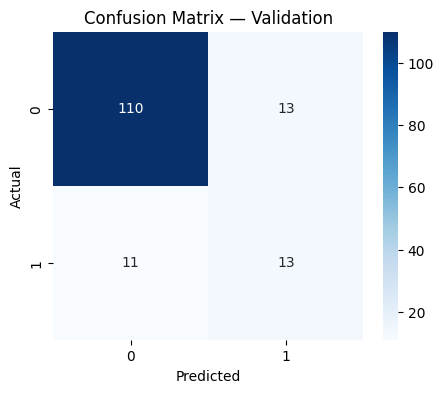
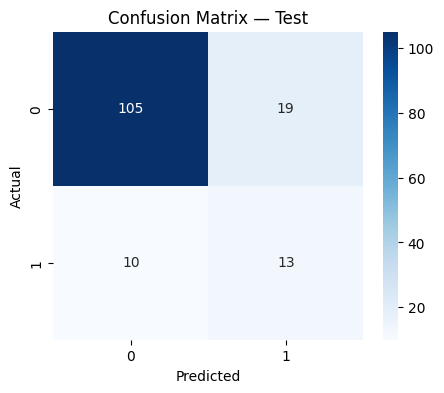
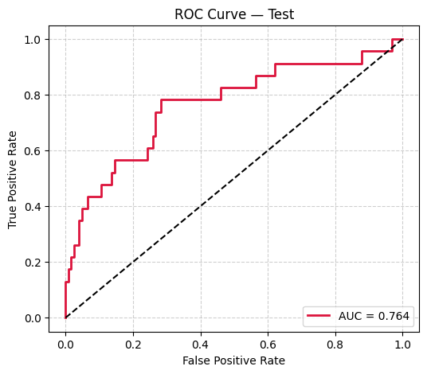
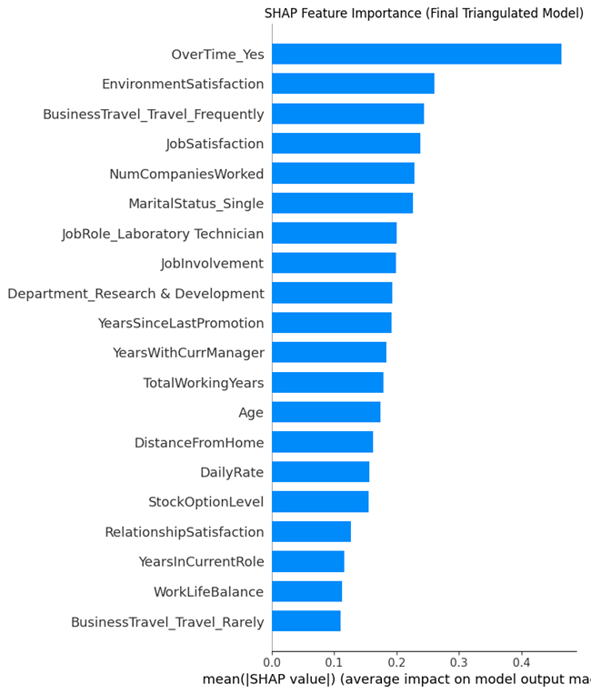
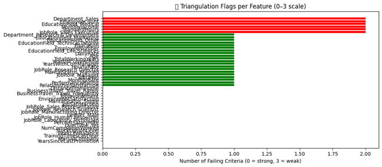
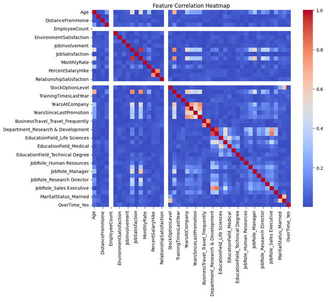

# ⚡ Logistic Regression — Employee Attrition Prediction (Triangulated ML Pipeline)

This project demonstrates an **end-to-end Logistic Regression pipeline** for predicting **employee attrition** using triangulated feature selection and threshold tuning.  
It includes complete evaluation steps: cross-validation, ROC/PR curves, confusion matrices, and interpretability using **SHAP**, **Permutation Importance**, and **VIF**.

---

## 🚀 Key Highlights
- Implemented **Logistic Regression** with L1/L2 regularization  
- **Triangulated feature selection** (SHAP + Permutation Importance + VIF)  
- 5–15 fold cross-validation with metrics: Accuracy, Precision, Recall, F1, ROC-AUC  
- **Threshold tuning** for Balanced and High Recall modes  
- **Class-weight optimization** for imbalanced data  
- **SHAP-based explainability** and correlation heatmaps  
- **Gradio UI** for interactive predictions  
- **MLflow** tracking for experiments  

---

## 📊 Model Evaluation Results

### Confusion Matrices

---

### ROC & PR Curves

---

### Feature Importance & Triangulation

---

## 💡 Insights
- **Triangulated pruning** improved model generalization.  
- Optimal **threshold = 0.63 (Balanced)** achieved best F1 trade-off.  
- **Class-weight [1,7]** handled imbalance effectively.  
- Validation **ROC-AUC ≈ 0.84**, Test **ROC-AUC ≈ 0.76**, indicating consistent performance.  

---

## 🧩 Future Enhancements
- Integrate **Optuna** for hyperparameter optimization  
- Add **ensemble stacking** (Logistic + CatBoost + Neural Network)  
- Include **drift detection** for production HR dashboards  
- Deploy via **Streamlit Cloud** or **Hugging Face Spaces**  

---

## ⚙️ Dependencies
Refer to `requirements.txt` for all dependencies.

---

## 👨‍💻 Author
**Shubham Singh**

---

## 📜 License
MIT License
