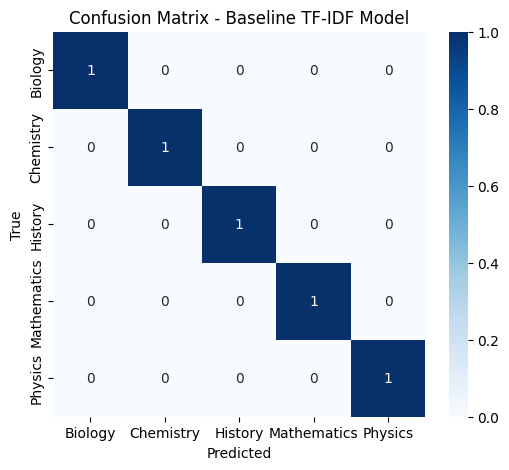
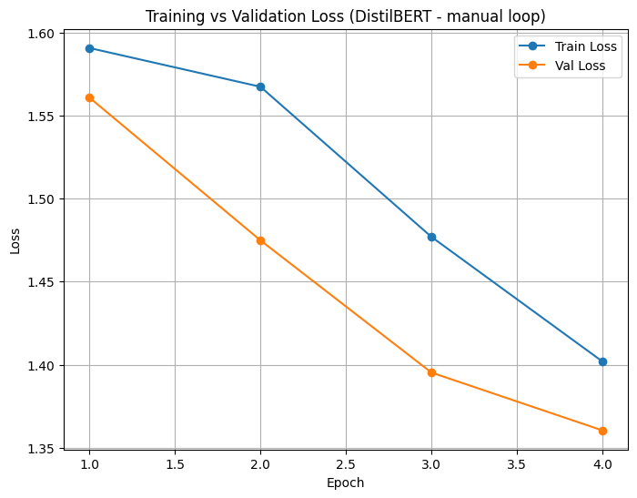
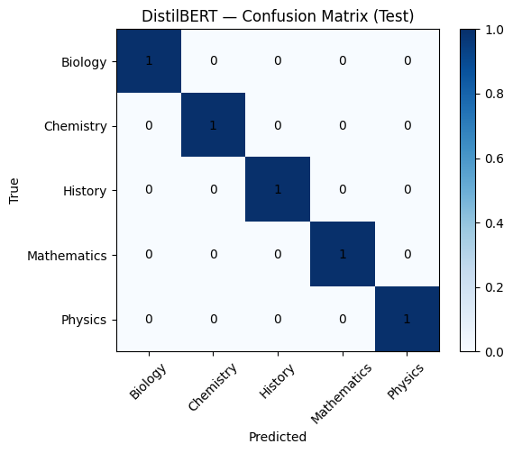

Automated Content Tagging Pipeline
This project implements an AI-powered tagging system for educational content. It classifies topics into subjects (Mathematics, Biology, Physics, Chemistry, History) and provides a baseline difficulty level (Easy, Medium, Hard). The tagging pipeline forms the foundation for mars_–_memory_and_retention_scheduling.
________________________________________
📌 Project Overview
Objective: Automatically tag learning topics with subject and difficulty to support adaptive retention scheduling.
Datasets:
•	topics.csv → Raw topic metadata (title, description).
•	topics_with_tags.csv → Topics with subject, difficulty, and tag labels.
•	topics_predicted_subjects.csv → Pipeline output with predicted subject tags.
Outputs:
•	Subject classification reports (baseline + transformer).
•	Confusion matrices for evaluation.
•	Train vs validation loss curves.
________________________________________
⚡ Features
•	Baseline Model → TF-IDF + Logistic Regression.
•	Transformer Model → DistilBERT fine-tuned on subject classification.
•	Balanced synthetic dataset → 50 topics (10 per subject).
•	Colab-ready training loop (no tokens, no external logging).
•	Export predictions for downstream integration with BADRI.
________________________________________
📊 Results
1.	Baseline TF-IDF Model
o	Accuracy: 100% (due to separable synthetic dataset).
o	Confusion Matrix: Perfect diagonal classification.

2.	DistilBERT Fine-Tuning
o	Trained for 4 epochs with manual PyTorch loop.
o	Loss decreased consistently (no overfitting).
o	Confusion Matrix: Perfect subject classification.
Loss Curve:

Confusion Matrix:

________________________________________
🚀 Project Workflow
1.	Data Preparation
o	Generate balanced dataset (50 topics across 5 subjects).
o	Assign baseline difficulty levels.
2.	Baseline Classifier
o	TF-IDF feature extraction.
o	Logistic Regression for subject classification.
3.	Transformer Training
o	DistilBERT with manual training loop.
o	Track train/val loss, evaluate on test.
4.	Prediction Export
o	Save topics_predicted_subjects.csv for BADRI integration.
________________________________________
📂 Project Structure
├── topics.csv                     # Raw topics
├── topics_with_tags.csv            # Topics with subject/difficulty
├── topics_predicted_subjects.csv   # Predictions from pipeline
├── simplemethod.png                # Baseline TF-IDF confusion matrix
├── LINECHART.png                   # DistilBERT loss curve
├── DISTILBERT.png                  # DistilBERT confusion matrix
└── README.md                       # Project documentation
________________________________________
👤 Author
Shubham Singh
________________________________________
📜 License
MIT License.
