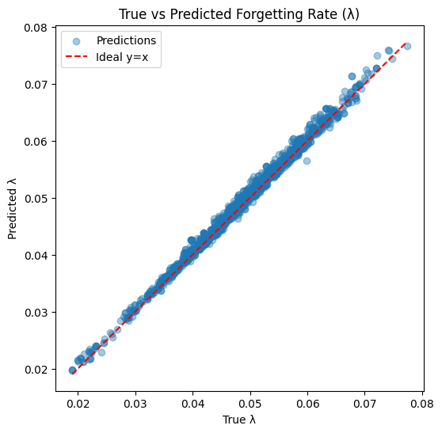
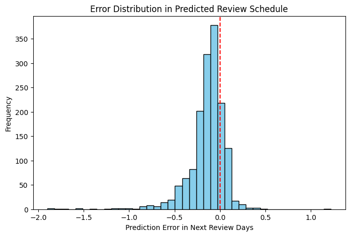

MARS – Memory and Retention Scheduling
This project implements MARS (Memory and Retention Scheduling), an AI-driven framework to model human memory retention and generate personalized review schedules.
We provide two complementary approaches:
1.	Mathematical Baseline – Log-linear forgetting curve fitting (rule-based).
2.	Machine Learning (Keras) – Neural network predicting forgetting rate (λ) from student & topic features.
________________________________________
📌 Project Overview
•	Objective: Recommend optimal review dates so that student retention remains above 60%.
•	Datasets:
o	students.csv → Student features (grade, ability, diligence)
o	topics.csv → Topic metadata (subject, difficulty)
o	interactions.csv → Logs of learning sessions with performance scores
•	Outputs:
o	recommendations.csv → Baseline math-based scheduling
o	recommendations_ml.csv → ML-enhanced scheduling using Keras
________________________________________
⚡ Features
•	Log-linear forgetting curve modeling (baseline)
•	Deep learning pipeline with Keras + TensorFlow
•	80/10/10 Train–Validation–Test split with scaling
•	Evaluation metrics: MAE, RMSE, R²
•	Personalized next review prediction (next_review_date_pred)
________________________________________
📊 Results
1. Training Loss Curve
Shows convergence of the neural network.

3. True vs Predicted λ
Scatter plot comparing actual vs model-predicted forgetting rates.

5. Error Distribution
Histogram of prediction errors in next review days.

________________________________________
🚀 Project Workflow
1.	Baseline (mars_–_memory_and_retention_scheduling.py)
o	Estimate λ via log-linear regression
o	Compute next review dates
o	Save recommendations.csv
2.	Keras ML (mars_–_memory_and_retention_scheduling_using_keras.py)
o	Merge student, topic, and interaction data
o	Feature engineering (one-hot encoding, scaling)
o	Train neural network to predict λ
o	Evaluate with metrics and plots
o	Save recommendations_ml.csv
________________________________________
📂 Project Structure
•	students.csv – Student features
•	topics.csv – Topic features
•	interactions.csv – Interaction logs
•	recommendations.csv – Baseline output
•	recommendations_ml.csv – ML-enhanced output
•	mars_–_memory_and_retention_scheduling.py – Baseline script
•	mars_–_memory_and_retention_scheduling_using_keras.py – Keras ML script
•	dot_plot.png, learning_loss_curve.png, error_distribution.png – Result graphs
________________________________________
👤 Author
Shubham Singh
________________________________________
📜 License
MIT License.
