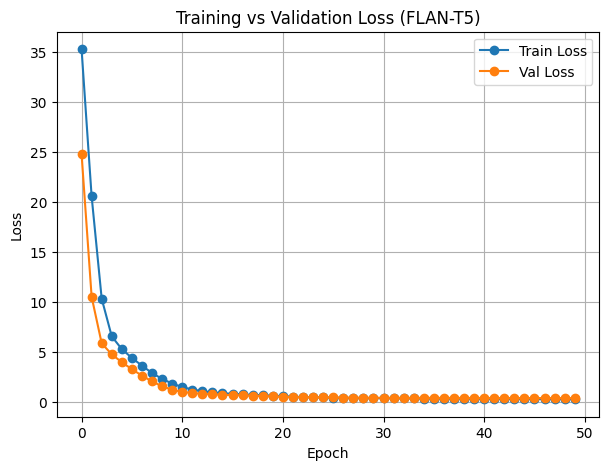

MathGPT & TeacherGPT
📌 Overview
This repository contains two interconnected projects:
1.	MathGPT → A domain-specific reasoning model fine-tuned on textbook-style math problems (linear equations, quadratics, fractions, geometry, probability, etc.).
2.	TeacherGPT → An AI tutoring assistant built on top of MathGPT, designed to provide step-by-step guided explanations through a simple front-end interface.
Both projects are powered by FLAN-T5 (Google’s instruction-tuned encoder–decoder model), trained and optimized for mathematical reasoning tasks.
________________________________________
⚙️ Project Workflow
Step 1 — Load & Clean Dataset
•	Dataset: mathgpt_dataset.csv
•	Contains 108 structured math problems across 9 categories.
•	Cleaning removes duplicates, trims whitespace, and normalizes columns (problem, solution).
________________________________________
Step 2 — Dataset & DataLoader Prep
•	Tokenization using google/flan-t5-small.
•	Problems framed as “Solve step by step”.
•	Custom PyTorch Dataset + DataLoader.
•	90/10 split for training and validation.
________________________________________
Step 3 — Training Loop
•	Model: FLAN-T5 Small (T5ForConditionalGeneration).
•	Optimizer: AdamW (lr=5e-5).
•	Loss: Cross-entropy (ignoring pad tokens).
•	Epochs: 50.
•	Checkpoints saved under mathgpt_flan_t5_small/.
Loss Curve (Training vs Validation):

________________________________________
Step 4 — Optimized Inference
•	Few-shot prompting added for better reasoning.
•	Beam search (num_beams=10) with repetition penalty.
•	Encourages multi-step explanations instead of single-line answers.
________________________________________
🧑‍🏫 TeacherGPT — Math Reasoning Assistant
TeacherGPT wraps MathGPT into a tutoring interface.
Features
•	Accepts natural math queries.
•	Returns guided, step-by-step explanations.
•	Can be deployed as a Gradio app for interactive tutoring.
________________________________________
📂 Repository Structure
├── mathgpt_dataset.csv             # Original dataset (108 problems)
├── mathgpt_dataset_clean.csv       # Cleaned dataset
├── mathsgpt_&_teachergpt.py        # End-to-end pipeline (MathGPT + TeacherGPT)
├── linechart.png                   # Training vs Validation loss curve
├── README.md                       # Project documentation
________________________________________
🚀 Future Work
•	Expand dataset beyond 108 problems for stronger generalization.
•	Add categories: calculus, combinatorics, word problems.
•	Deploy TeacherGPT as a persistent tutoring assistant.
•	Experiment with larger FLAN-T5 (base/large) on GPU clusters.
________________________________________
👤 Author
Shubham Singh

________________________________________
📜 License
MIT License 
