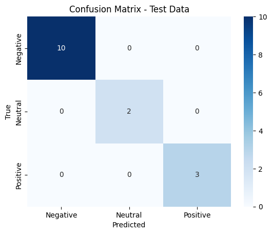
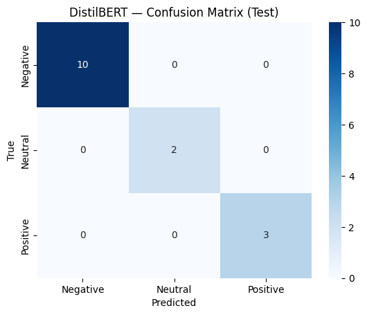
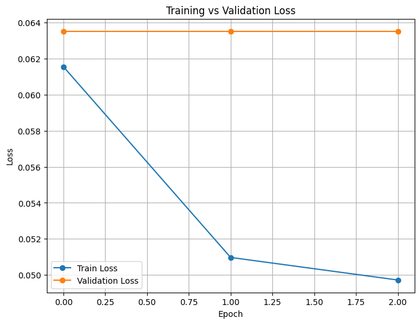

Sentiment Analysis & Churn Rate Prediction
This project applies AI/ML to analyze Net Promoter Score (NPS) feedback data from students/parents in the EdTech sector. The goal is twofold:
1.	Sentiment Analysis – Classify feedback into Negative, Neutral, and Positive sentiments.
2.	Churn Prediction – Estimate iteration (churn) rate directly from detractor proportion in NPS.
We provide two complementary approaches:
•	Baseline Model (Logistic Regression + TF-IDF) – interpretable, fast, effective on small data.
•	Advanced Model (DistilBERT, Hugging Face Transformers) – contextual embeddings with early stopping, GPU acceleration, and higher accuracy.
________________________________________
📌 Project Overview
Objective:
Predict student/parent sentiment from feedback text and derive NPS + churn rate to inform business decisions.
Dataset:
•	nps_feedback.csv → Contains student_id, nps_score (0–10), and feedback_text.
Outputs:
•	Sentiment predictions (Negative / Neutral / Positive)
•	Confusion matrices for both baseline and transformer models
•	Training vs validation loss curve for DistilBERT
•	NPS, churn rate (% of detractors), and retention rate
________________________________________
⚡ Features
•	Baseline Sentiment Classifier: TF-IDF + Logistic Regression
•	Advanced Sentiment Classifier: DistilBERT fine-tuned with Hugging Face
•	80/10/10 Train–Validation–Test split
•	Evaluation metrics: Accuracy, Precision, Recall, F1-score, Confusion Matrix
•	Business Metrics: Net Promoter Score (NPS), Estimated Churn Rate, Retention Rate
________________________________________
📊 Results
1. Confusion Matrix – Baseline Logistic Regression
   
2. Confusion Matrix – DistilBERT
 
3. Training vs Validation Loss (DistilBERT with Early Stopping)

Metrics:
•	Test accuracy (baseline): ~1.0 (on small sample)
•	Test accuracy (DistilBERT): ~1.0 (perfect classification on test split)
•	NPS ≈ Promoters % − Detractors %
•	Iteration (Churn) Rate ≈ % of Detractors
•	Retention Rate ≈ 100 − Churn Rate
________________________________________
🚀 Project Workflow
Baseline Pipeline (sentiment_analysis_and_churn_rate_prediction.py):
1.	Load NPS feedback data
2.	Map NPS scores → Sentiment labels
3.	TF-IDF vectorization of text
4.	Train Logistic Regression model
5.	Evaluate on validation and test sets
6.	Plot confusion matrix
Transformer Pipeline (DistilBERT):
1.	Load and tokenize dataset
2.	Convert to Hugging Face DatasetDict
3.	Fine-tune DistilBERT for 3-class sentiment classification
4.	Apply early stopping based on validation loss
5.	Evaluate on test set and plot confusion matrix
6.	Plot train vs validation loss curve
________________________________________
📂 Project Structure
•	nps_feedback.csv – Raw NPS feedback data
•	sentiment_analysis_and_churn_rate_prediction.py – Colab notebook with both models
•	basic model.png – Confusion Matrix (Logistic Regression)
•	distilledBERT model.png – Confusion Matrix (DistilBERT)
•	line graph.png – Train vs Validation Loss Curve
•	New Microsoft Word Document.DOCX – Project notes/draft
________________________________________
👤 Author
Shubham Singh
________________________________________
📜 License
MIT License.
